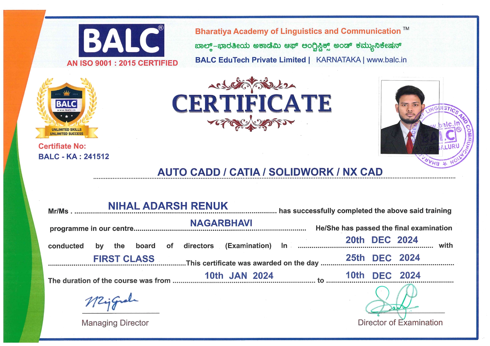
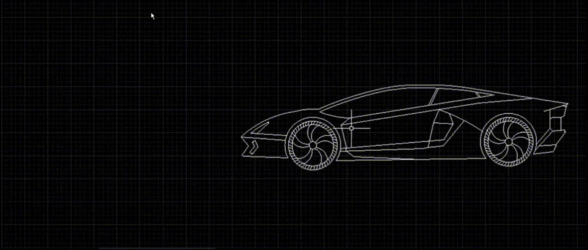

# Hi, I'm Nihal Adarsh Renuk 👋

-  I’m interested in **CAD and Simulation**.
-  I’m currently learning more about **Mechanical CAD/CAM** and **Simulation** in the context of mechanical engineering.
-  I’m looking to collaborate on projects related to  **drone technology** and **automated systems**.
-  How to reach me: [LinkedIn](https://www.linkedin.com/in/nihal-adarsh-renuk/)
-  Projects: I worked on a **Development, Automation and Implementation of an Agro-Seeding Drone, Laser Security System Multi-axis robotic arm assembly** and **V6 engine assembly** project during my studies!

---
### 💼 **Certificates:**

---
### 🛠️ **Mechanical CAD Software:**

 

 

 

  ---

  ### 🎥 AutoCAD:

- **2D:**  
  

- **3D MODEL:**  
  
  
- **CAR:**  
  

- **Orthographic Projection:**  
  

 ---

  ### 🎥 SOLIDWORKS:

- **Bevel and Spur gear motion:**  
  

- **Flange coupling:**  
  
  
- **Sheet metal-Switch box:**  
  

  ---

### 🎥 CATIA V5:

- **2D:**  
  

- **Assembly:**  
  

- **Sheet-Metal:**  
  
  
- **PROJECT:Multi-Axis Robotic Arm Assembly**  
  

  ---
  
  ### 🎥 NX CAD:

- **3D:**  
  

- **Assembly:**  
  

- **Sheet-Metal:**  
  

- **PROJECT:V6 Engine Assembly**
   
 
- **V6 Motion**  
  

### About Me

I am a passionate **Mechanical Engineer** with a keen interest in **CAD DESIGNING** and **SIMULATION**. Throughout my career, I've focused on improving design processes and automating systems, particularly in the areas of **CAD design**, and **simulation**. I am always excited to explore new technologies and applications that bridge mechanical engineering with cutting-edge innovations.

If you're interested in collaborating or just want to chat about **drones** or **CAD**, feel free to reach out to me!

